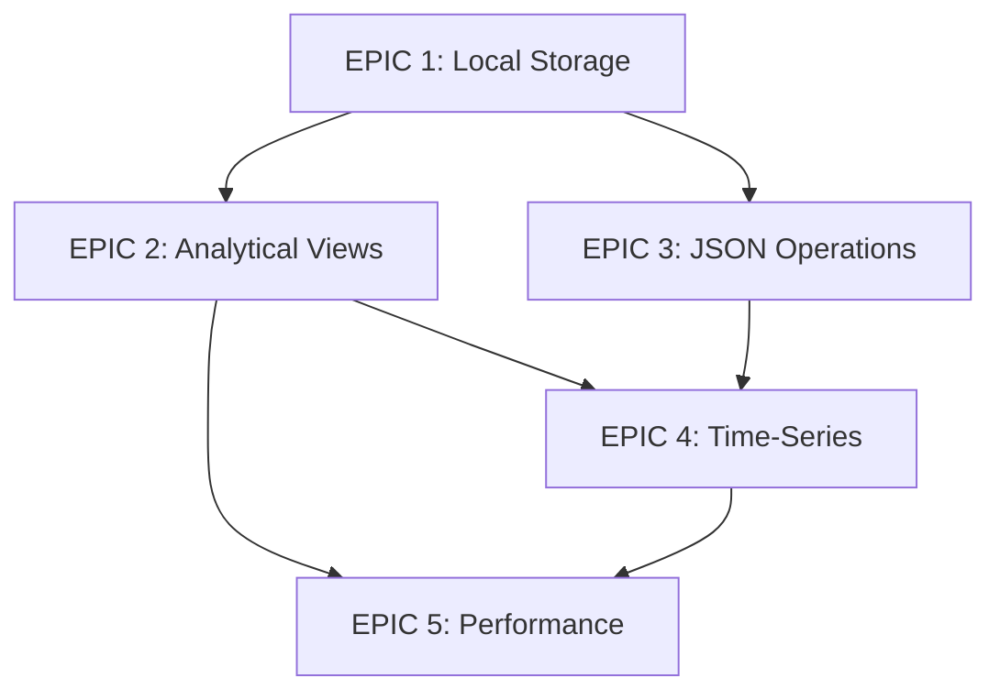

# DuckDB Optimization Implementation Plan

## Overview
This document outlines the structured implementation plan for optimizing Tiergarten with DuckDB's analytical capabilities. Each EPIC includes specific tasks, acceptance criteria, and quality gates to prevent technical debt.

## EPIC 1: Local Ticket Storage & Sync Infrastructure
**Goal**: Eliminate API polling by storing tickets locally and implementing efficient sync mechanisms

### Tasks:
1. **TASK 1.1: Implement Ticket Storage Service**
   - Create `TicketStorageService` class
   - Implement CRUD operations for `jira_tickets` table
   - Add batch insert capabilities
   - Add error handling and retry logic
   - **Quality Gates**:
     - Unit tests with 90% coverage
     - Error handling for all edge cases
     - Performance benchmarks (< 100ms for 1000 tickets)

2. **TASK 1.2: Create Sync Orchestrator**
   - Build `JiraSyncOrchestrator` service
   - Implement full sync vs incremental sync logic
   - Add sync status tracking
   - Create sync scheduling mechanism
   - **Quality Gates**:
     - Integration tests with mock JIRA API
     - Sync status properly tracked in database
     - No data loss during sync failures

3. **TASK 1.3: Add Sync Monitoring & Logging**
   - Create sync_history table
   - Implement detailed logging
   - Add performance metrics collection
   - Create sync health endpoint
   - **Quality Gates**:
     - All sync operations logged
     - Metrics accessible via API
     - Alert on sync failures

4. **TASK 1.4: Migrate Existing Ticket Fetching**
   - Update all endpoints to use local storage
   - Remove direct JIRA API calls from endpoints
   - Update frontend to handle new data source
   - **Quality Gates**:
     - No regression in functionality
     - Performance improvement documented
     - Backward compatibility maintained

### Acceptance Criteria:
- Tickets are stored locally and synced periodically
- Sync process handles failures gracefully
- Performance improves by >80% for ticket queries
- Zero data loss during sync operations

---

## EPIC 2: Analytical Views & Dashboard Optimization
**Goal**: Leverage DuckDB's analytical capabilities for instant dashboard queries

### Tasks:
1. **TASK 2.1: Create Core Analytical Views**
   - Design ticket_analytics view
   - Implement dashboard_metrics view
   - Add tier_distribution view
   - Create time_series_metrics view
   - **Quality Gates**:
     - Views tested with production-like data
     - Query performance < 50ms
     - Views handle NULL values correctly

2. **TASK 2.2: Implement Widget Query Optimizer**
   - Create `WidgetQueryBuilder` class
   - Convert widget filters to optimized SQL
   - Add query caching layer
   - Implement parallel widget loading
   - **Quality Gates**:
     - Unit tests for all filter combinations
     - Query plans analyzed and optimized
     - No N+1 query issues

3. **TASK 2.3: Add Real-time Metrics API**
   - Create /api/analytics/realtime endpoint
   - Implement WebSocket for live updates
   - Add metric aggregation service
   - **Quality Gates**:
     - Response time < 100ms
     - WebSocket handles reconnection
     - Metrics accuracy validated

4. **TASK 2.4: Optimize Dashboard Loading**
   - Implement single-query dashboard loading
   - Add client-side caching
   - Create dashboard snapshot capability
   - **Quality Gates**:
     - Dashboard loads in < 500ms
     - Caching strategy documented
     - Memory usage monitored

### Acceptance Criteria:
- Dashboard load time reduced by >90%
- All widgets load in parallel
- Real-time updates without polling
- Analytics queries optimized and indexed

---

## EPIC 3: Advanced Filtering & JSON Operations
**Goal**: Simplify and optimize complex filtering using DuckDB's JSON capabilities

### Tasks:
1. **TASK 3.1: Implement JSON Schema for Custom Fields**
   - Define custom fields JSON schema
   - Create validation functions
   - Add JSON indexes
   - Migrate existing data
   - **Quality Gates**:
     - Schema validates all existing data
     - JSON queries use indexes
     - Migration reversible

2. **TASK 3.2: Build Advanced Filter Engine**
   - Create `FilterQueryBuilder` class
   - Support complex filter combinations
   - Add filter preset management
   - Implement filter performance analysis
   - **Quality Gates**:
     - All filter types supported
     - Query performance documented
     - Filter syntax validated

3. **TASK 3.3: Create Filter UI Components**
   - Build advanced filter builder UI
   - Add filter preview functionality
   - Implement saved filter management
   - **Quality Gates**:
     - UI tested across browsers
     - Accessibility standards met
     - Filter preview accurate

### Acceptance Criteria:
- Complex filters execute in < 100ms
- JSON fields fully searchable
- Filter UI intuitive and responsive
- All existing filters migrated successfully

---

## EPIC 4: Time-Series Analytics & Reporting
**Goal**: Provide advanced analytics and reporting capabilities

### Tasks:
1. **TASK 4.1: Implement Time-Series Data Model**
   - Create ticket_trends table
   - Add aging calculation views
   - Implement SLA tracking
   - Build cumulative metrics
   - **Quality Gates**:
     - Historical data preserved
     - Calculations validated
     - Performance benchmarked

2. **TASK 4.2: Create Analytics API**
   - Build trend analysis endpoints
   - Add predictive metrics
   - Implement export capabilities
   - Create report scheduling
   - **Quality Gates**:
     - API documented with OpenAPI
     - Export formats validated
     - Report accuracy verified

3. **TASK 4.3: Build Analytics Dashboard**
   - Create trend visualization components
   - Add interactive charts
   - Implement drill-down capability
   - **Quality Gates**:
     - Charts render < 200ms
     - Data accuracy validated
     - Mobile responsive

### Acceptance Criteria:
- Historical trends available instantly
- Reports exportable in multiple formats
- Predictive analytics accurate to >80%
- Time-series queries optimized

---

## EPIC 5: Performance Monitoring & Optimization
**Goal**: Ensure system performance and prevent degradation

### Tasks:
1. **TASK 5.1: Implement Query Performance Monitoring**
   - Add query execution tracking
   - Create slow query log
   - Build performance dashboard
   - Add automatic index recommendations
   - **Quality Gates**:
     - All queries tracked
     - Slow queries alerted
     - Dashboard real-time

2. **TASK 5.2: Create Performance Test Suite**
   - Build load testing framework
   - Add query benchmark suite
   - Implement regression detection
   - **Quality Gates**:
     - Tests run in CI/CD
     - Benchmarks documented
     - Regressions blocked

3. **TASK 5.3: Optimize Database Schema**
   - Review and optimize indexes
   - Implement partitioning if needed
   - Add query hints where beneficial
   - **Quality Gates**:
     - Index usage validated
     - No redundant indexes
     - Schema changes tested

### Acceptance Criteria:
- All queries execute < 100ms
- Performance monitored continuously
- Regressions detected automatically
- System scales to 1M+ tickets

---

## Implementation Order & Dependencies

## Global Quality Gates

### Code Quality
- [ ] TypeScript types for all new code
- [ ] ESLint passing with no warnings
- [ ] Code coverage > 85%
- [ ] All functions documented with JSDoc
- [ ] No console.log statements in production code

### Performance
- [ ] All API endpoints respond < 200ms (p95)
- [ ] Database queries execute < 100ms (p95)
- [ ] Memory usage stable under load
- [ ] No memory leaks detected

### Security
- [ ] All inputs validated and sanitized
- [ ] SQL injection prevention verified
- [ ] Authentication required for all endpoints
- [ ] Sensitive data encrypted at rest

### Operations
- [ ] All features have monitoring
- [ ] Errors logged with context
- [ ] Health checks implemented
- [ ] Rollback plan documented

### Documentation
- [ ] API documentation updated
- [ ] Architecture diagrams current
- [ ] Runbook for common issues
- [ ] Performance tuning guide

## Risk Mitigation

1. **Data Loss Risk**
   - Mitigation: Implement write-ahead logging
   - Backup before each migration
   - Test rollback procedures

2. **Performance Regression Risk**
   - Mitigation: Automated performance tests
   - Query plan analysis in CI/CD
   - Gradual rollout with monitoring

3. **Integration Risk**
   - Mitigation: Feature flags for all changes
   - Parallel run old/new systems
   - Comprehensive integration tests

4. **Technical Debt Risk**
   - Mitigation: Code reviews required
   - Refactoring time in each sprint
   - Technical debt tracking

## Success Metrics

- **Performance**: 90% reduction in dashboard load time
- **Reliability**: 99.9% uptime for sync operations  
- **Scalability**: Support 1M+ tickets with <100ms queries
- **User Satisfaction**: 50% reduction in performance complaints
- **Developer Velocity**: 30% faster feature development

## Next Steps

1. Start with EPIC 1: Local Ticket Storage
2. Set up performance baseline measurements
3. Create feature flags for gradual rollout
4. Establish monitoring infrastructure